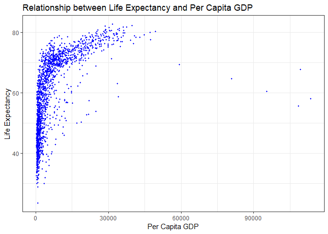
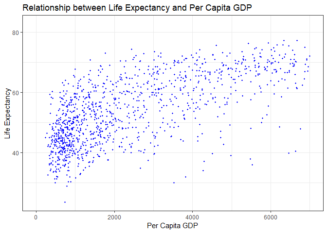
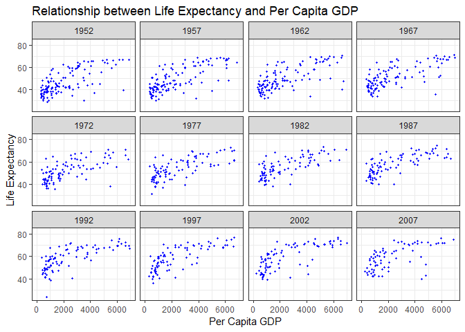
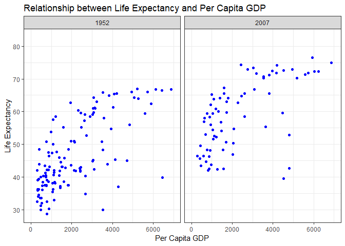
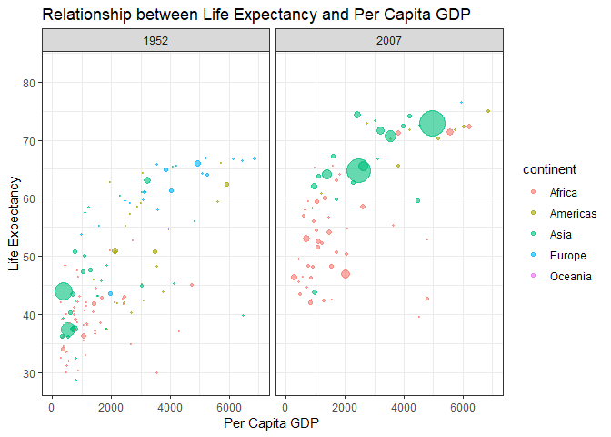
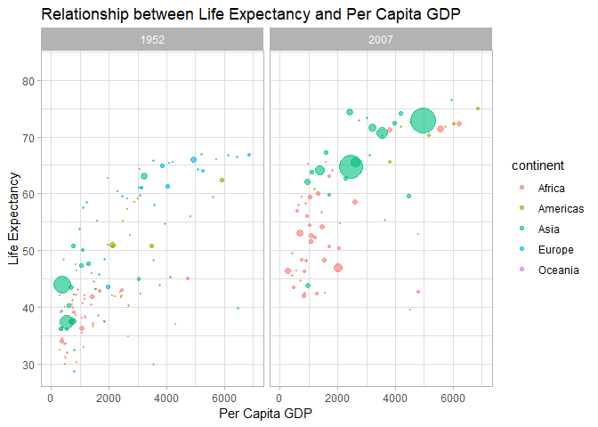
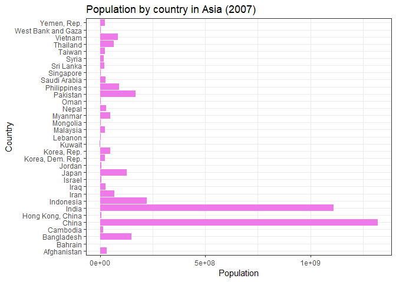
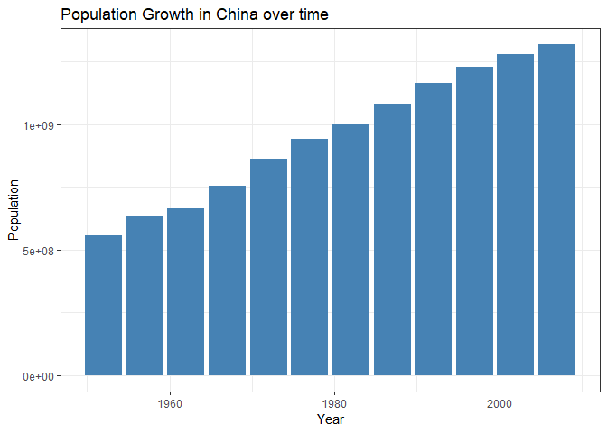
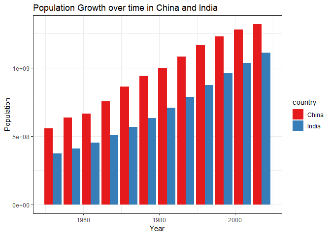

## Load the libraries

```r
library(tidyverse)
library(skimr)
library("RColorBrewer")
library("gapminder")
```

## Resources
The idea for this assignment came from [Rebecca Barter's](http://www.rebeccabarter.com/blog/2017-11-17-ggplot2_tutorial/) ggplot tutorial so if you get lost go have a look. Please do not copy and paste her code!  

## Gapminder
For this assignment, we are going to use the dataset [gapminder](https://cran.r-project.org/web/packages/gapminder/index.html). Gapminder includes information about economics, population, and life expectancy from countries all over the world. You will need to install it before use.

```r
#install.packages("gapminder")
```


Please load the data into a new object called gapminder.

```r
gapminder <- 
  gapminder::gapminder
```

1. Explore the data using the various function you have learned. Is it tidy, are there any NA's, what are its dimensions, what are the column names, etc.

```r
#Finding NAs - no NA found
skim(gapminder)
```

```
## Skim summary statistics
##  n obs: 1704 
##  n variables: 6 
## 
## -- Variable type:factor -----------------------------------------------------------------------
##   variable missing complete    n n_unique
##  continent       0     1704 1704        5
##    country       0     1704 1704      142
##                              top_counts ordered
##  Afr: 624, Asi: 396, Eur: 360, Ame: 300   FALSE
##      Afg: 12, Alb: 12, Alg: 12, Ang: 12   FALSE
## 
## -- Variable type:integer ----------------------------------------------------------------------
##  variable missing complete    n    mean       sd    p0        p25     p50
##       pop       0     1704 1704 3e+07    1.1e+08 60011 2793664    7e+06  
##      year       0     1704 1704  1979.5 17.27     1952    1965.75  1979.5
##       p75       p100     hist
##  2e+07       1.3e+09 <U+2587><U+2581><U+2581><U+2581><U+2581><U+2581><U+2581><U+2581>
##   1993.25 2007       <U+2587><U+2583><U+2587><U+2583><U+2583><U+2587><U+2583><U+2587>
## 
## -- Variable type:numeric ----------------------------------------------------------------------
##   variable missing complete    n    mean      sd     p0     p25     p50
##  gdpPercap       0     1704 1704 7215.33 9857.45 241.17 1202.06 3531.85
##    lifeExp       0     1704 1704   59.47   12.92  23.6    48.2    60.71
##      p75      p100     hist
##  9325.46 113523.13 <U+2587><U+2581><U+2581><U+2581><U+2581><U+2581><U+2581><U+2581>
##    70.85     82.6  <U+2581><U+2582><U+2585><U+2585><U+2585><U+2585><U+2587><U+2583>
```


```r
#Column names
names(gapminder)
```

```
## [1] "country"   "continent" "year"      "lifeExp"   "pop"       "gdpPercap"
```

```r
#Dimensions are 1704 rows and 6 columns
dim(gapminder)
```

```
## [1] 1704    6
```


2. We are interested in the relationship between per capita GDP and life expectancy; i.e. does having more money help you live longer on average. Make a quick plot below to visualize this relationship.

```r
gapminder %>% 
  ggplot(aes(x = gdpPercap, y = lifeExp)) +
  geom_point(col = "blue", size = 0.8) +
  labs(title = "Relationship between Life Expectancy and Per Capita GDP",
       y = "Life Expectancy",
       x = "Per Capita GDP") +
  theme_bw()
```

<!-- -->


3. There is extreme disparity in per capita GDP. Rescale the x axis to make this easier to interpret. How would you characterize the relationship?

```r
gapminder %>% 
  ggplot(aes(x = gdpPercap, y = lifeExp)) +
  xlim(0, 7000) +
  geom_point(col = "blue", size = 0.8) +
  labs(title = "Relationship between Life Expectancy and Per Capita GDP",
       y = "Life Expectancy",
       x = "Per Capita GDP") +
  theme_bw()
```

```
## Warning: Removed 550 rows containing missing values (geom_point).
```

<!-- -->


```r
# It looks like the higher the GDP then the greater the life expectancy.
```


4. This should look pretty dense to you with significant overplotting. Try using a faceting approach to break this relationship down by year.

```r
gapminder %>% 
  ggplot(aes(x = gdpPercap, y = lifeExp)) +
  xlim(0, 7000) +
  geom_point(col = "blue", size = 0.8) +
  labs(title = "Relationship between Life Expectancy and Per Capita GDP",
       y = "Life Expectancy",
       x = "Per Capita GDP") +
  facet_wrap(~year) +
  theme_bw()
```

```
## Warning: Removed 550 rows containing missing values (geom_point).
```

<!-- -->


5. Simplify the comparison by comparing only 1952 and 2007. Can you come to any conclusions?

```r
gapminder %>% 
  filter(year == 1952 | year == 2007) %>%  
  ggplot(aes(x = gdpPercap, y = lifeExp)) +
  xlim(0, 7000) +
  geom_point(col = "blue") +
  labs(title = "Relationship between Life Expectancy and Per Capita GDP",
       y = "Life Expectancy",
       x = "Per Capita GDP") +
  facet_wrap(~year) +
  theme_bw()
```

```
## Warning: Removed 86 rows containing missing values (geom_point).
```

<!-- -->

```r
#Life expectancy appears to be higher with a higher GDP. The range of per capita GDP did not change much in 2007 compared to 1952, but it looks like it shifted up. 
```


6. Let's stick with the 1952 and 2007 comparison but make some aesthetic adjustments. First try to color by continent and adjust the size of the points by population. Add `+ scale_size(range = c(0.1, 10), guide = "none")` as a layer to clean things up a bit.

```r
gapminder %>% 
  filter(year == 1952 | year == 2007) %>%  
  ggplot(aes(x = gdpPercap, y = lifeExp, color = continent, size = pop)) +
  xlim(0, 7000) +
  geom_point(alpha = 0.6) +
  scale_size(range = c(0.1, 10), guide = "none") +
  labs(title = "Relationship between Life Expectancy and Per Capita GDP",
       y = "Life Expectancy",
       x = "Per Capita GDP") +
  facet_wrap(~year) +
  theme_bw()
```

```
## Warning: Removed 86 rows containing missing values (geom_point).
```

<!-- -->


7. Although we did not introduce them in lab, ggplot has a number of built-in themes that make things easier. I like the light theme for these data, but you can see lots of options. Apply one of these to your plot above.

```r
gapminder %>% 
  filter(year == 1952 | year == 2007) %>%  
  ggplot(aes(x = gdpPercap, y = lifeExp, color = continent)) +
  xlim(0, 7000) +
  geom_point(alpha = 0.6, aes(size = pop)) +
  scale_size(range = c(0.1, 10), guide = "none") +
  labs(title = "Relationship between Life Expectancy and Per Capita GDP",
       y = "Life Expectancy",
       x = "Per Capita GDP") +
  facet_wrap(~year) +
  theme_light()
```

```
## Warning: Removed 86 rows containing missing values (geom_point).
```

<!-- -->

```r
#how to add legend for pop?
```

8. What is the population for all countries on the Asian continent in 2007? Show this as a barplot.

```r
gapminder %>% 
  filter(continent == "Asia" & year == 2007) %>% 
  ggplot(aes(x = country, y = pop)) +
  geom_bar(stat = "identity", fill = "orchid2") +
  labs(title = "Population by country in Asia (2007)",
       y = "Population",
       x = "Country") +
  coord_flip() +
  theme_bw()
```

<!-- -->


9. You should see that China's population is the largest with India a close second. Let's focus on China only. Make a plot that shows how population has changed over the years.

```r
gapminder %>% 
  filter(country == "China") %>% 
  ggplot(aes(x = year, y = pop)) +
  geom_bar(stat = "identity", fill = "steelblue") +
  labs(title = "Population Growth in China over time",
       y = "Population",
       x = "Year") +
  theme_bw()
```

<!-- -->


10. Let's compare China and India. Make a barplot that shows population growth by year using `position=dodge`. Apply a custom color theme using RColorBrewer.

```r
brewer.pal.info
```

```
##          maxcolors category colorblind
## BrBG            11      div       TRUE
## PiYG            11      div       TRUE
## PRGn            11      div       TRUE
## PuOr            11      div       TRUE
## RdBu            11      div       TRUE
## RdGy            11      div      FALSE
## RdYlBu          11      div       TRUE
## RdYlGn          11      div      FALSE
## Spectral        11      div      FALSE
## Accent           8     qual      FALSE
## Dark2            8     qual       TRUE
## Paired          12     qual       TRUE
## Pastel1          9     qual      FALSE
## Pastel2          8     qual      FALSE
## Set1             9     qual      FALSE
## Set2             8     qual       TRUE
## Set3            12     qual      FALSE
## Blues            9      seq       TRUE
## BuGn             9      seq       TRUE
## BuPu             9      seq       TRUE
## GnBu             9      seq       TRUE
## Greens           9      seq       TRUE
## Greys            9      seq       TRUE
## Oranges          9      seq       TRUE
## OrRd             9      seq       TRUE
## PuBu             9      seq       TRUE
## PuBuGn           9      seq       TRUE
## PuRd             9      seq       TRUE
## Purples          9      seq       TRUE
## RdPu             9      seq       TRUE
## Reds             9      seq       TRUE
## YlGn             9      seq       TRUE
## YlGnBu           9      seq       TRUE
## YlOrBr           9      seq       TRUE
## YlOrRd           9      seq       TRUE
```


```r
gapminder %>% 
  filter(country == "China"| country == "India") %>% 
  ggplot(aes(x = year, y = pop, fill = country)) +
  geom_bar(stat = "identity", position = "dodge") +
  labs(title = "Population Growth over time in China and India",
       y = "Population",
       x = "Year") +
  scale_fill_brewer(palette = "Set1") +
  theme_bw()
```

<!-- -->


## Push your final code to [GitHub](https://github.com/FRS417-DataScienceBiologists)
Make sure that you push your code into the appropriate folder. Also, be sure that you have check the `keep md` file in the knit preferences.
