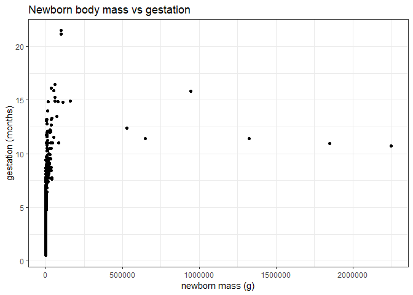
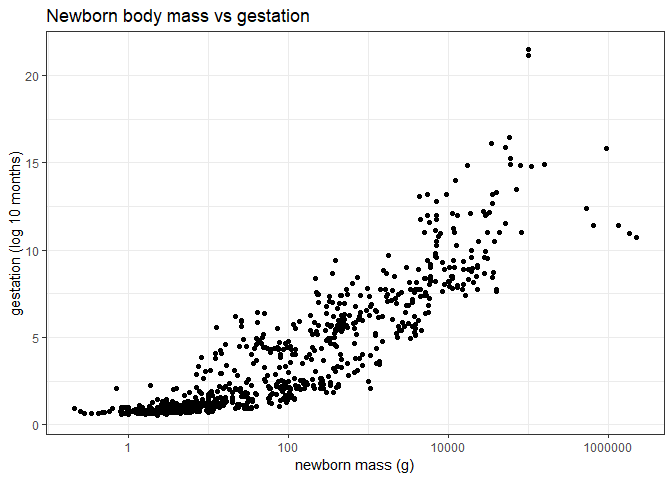
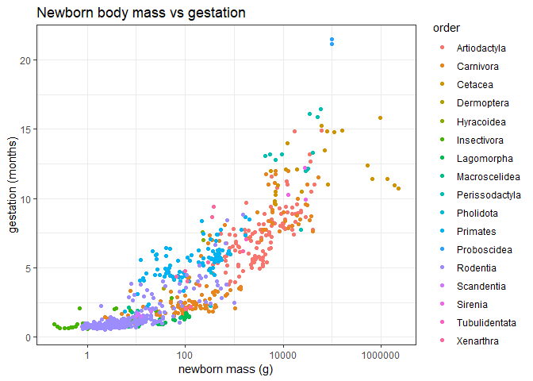
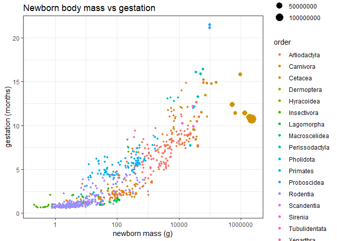
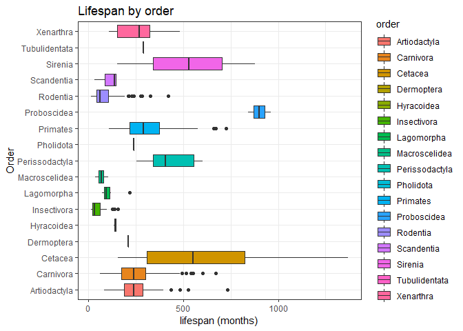

```r
library(tidyverse)
```

```
## -- Attaching packages ------------------------------------------------------------------------------ tidyverse 1.2.1 --
```

```
## v ggplot2 3.1.0     v purrr   0.3.0
## v tibble  2.0.1     v dplyr   0.7.8
## v tidyr   0.8.2     v stringr 1.3.1
## v readr   1.3.1     v forcats 0.3.0
```

```
## -- Conflicts --------------------------------------------------------------------------------- tidyverse_conflicts() --
## x dplyr::filter() masks stats::filter()
## x dplyr::lag()    masks stats::lag()
```

```r
library(skimr)
```
## Mammals Life History
Let's revisit the mammal life history data to practice our `ggplot` skills. Some of the tidy steps will be a repeat from the homework, but it is good practice. The [data](http://esapubs.org/archive/ecol/E084/093/) are from: *S. K. Morgan Ernest. 2003. Life history characteristics of placental non-volant mammals. Ecology 84:3402.*

1. Load the data.

```r
life_history <- read_csv("C:/Users/Stephanie T/Desktop/FRS_417/class_files-master/data/mammal_lifehistories_v2.csv")
```

```
## Parsed with column specification:
## cols(
##   order = col_character(),
##   family = col_character(),
##   Genus = col_character(),
##   species = col_character(),
##   mass = col_double(),
##   gestation = col_double(),
##   newborn = col_double(),
##   weaning = col_double(),
##   `wean mass` = col_double(),
##   AFR = col_double(),
##   `max. life` = col_double(),
##   `litter size` = col_double(),
##   `litters/year` = col_double()
## )
```


2. Use your preferred function to have a look. Do you notice any problems?

```r
skimr::skim(life_history)
```

```
## Skim summary statistics
##  n obs: 1440 
##  n variables: 13 
## 
## -- Variable type:character --------------------------------------------------------------------------------------------
##  variable missing complete    n min max empty n_unique
##    family       0     1440 1440   6  15     0       96
##     Genus       0     1440 1440   3  16     0      618
##     order       0     1440 1440   7  14     0       17
##   species       0     1440 1440   3  17     0     1191
## 
## -- Variable type:numeric ----------------------------------------------------------------------------------------------
##      variable missing complete    n      mean         sd   p0  p25     p50
##           AFR       0     1440 1440   -408.12     504.97 -999 -999    2.5 
##     gestation       0     1440 1440   -287.25     455.36 -999 -999    1.05
##   litter size       0     1440 1440    -55.63     234.88 -999    1    2.27
##  litters/year       0     1440 1440   -477.14     500.03 -999 -999    0.38
##          mass       0     1440 1440 383576.72 5055162.92 -999   50  403.02
##     max. life       0     1440 1440   -490.26     615.3  -999 -999 -999   
##       newborn       0     1440 1440   6703.15   90912.52 -999 -999    2.65
##     wean mass       0     1440 1440  16048.93   5e+05    -999 -999 -999   
##       weaning       0     1440 1440   -427.17     496.71 -999 -999    0.73
##      p75          p100     hist
##    15.61     210       <U+2586><U+2581><U+2581><U+2581><U+2581><U+2581><U+2587><U+2581>
##     4.5       21.46    <U+2583><U+2581><U+2581><U+2581><U+2581><U+2581><U+2581><U+2587>
##     3.83      14.18    <U+2581><U+2581><U+2581><U+2581><U+2581><U+2581><U+2581><U+2587>
##     1.15       7.5     <U+2587><U+2581><U+2581><U+2581><U+2581><U+2581><U+2581><U+2587>
##  7009.17       1.5e+08 <U+2587><U+2581><U+2581><U+2581><U+2581><U+2581><U+2581><U+2581>
##   147.25    1368       <U+2587><U+2581><U+2581><U+2583><U+2582><U+2581><U+2581><U+2581>
##    98    2250000       <U+2587><U+2581><U+2581><U+2581><U+2581><U+2581><U+2581><U+2581>
##    10          1.9e+07 <U+2587><U+2581><U+2581><U+2581><U+2581><U+2581><U+2581><U+2581>
##     2         48       <U+2586><U+2581><U+2581><U+2581><U+2581><U+2581><U+2581><U+2587>
```

```r
# There are some NAs in the data because there are -999 values
```


3. There are NA's. How are you going to deal with them?

```r
life_history_identNA <- 
  life_history %>% 
  na_if("-999") #replace -999 data with NA

life_history_identNA
```

```
## # A tibble: 1,440 x 13
##    order family Genus species   mass gestation newborn weaning `wean mass`
##    <chr> <chr>  <chr> <chr>    <dbl>     <dbl>   <dbl>   <dbl>       <dbl>
##  1 Arti~ Antil~ Anti~ americ~ 4.54e4      8.13   3246.    3           8900
##  2 Arti~ Bovid~ Addax nasoma~ 1.82e5      9.39   5480     6.5           NA
##  3 Arti~ Bovid~ Aepy~ melamp~ 4.15e4      6.35   5093     5.63       15900
##  4 Arti~ Bovid~ Alce~ busela~ 1.50e5      7.9   10167.    6.5           NA
##  5 Arti~ Bovid~ Ammo~ clarkei 2.85e4      6.8      NA    NA             NA
##  6 Arti~ Bovid~ Ammo~ lervia  5.55e4      5.08   3810     4             NA
##  7 Arti~ Bovid~ Anti~ marsup~ 3.00e4      5.72   3910     4.04          NA
##  8 Arti~ Bovid~ Anti~ cervic~ 3.75e4      5.5    3846     2.13          NA
##  9 Arti~ Bovid~ Bison bison   4.98e5      8.93  20000    10.7       157500
## 10 Arti~ Bovid~ Bison bonasus 5.00e5      9.14  23000.    6.6           NA
## # ... with 1,430 more rows, and 4 more variables: AFR <dbl>, `max.
## #   life` <dbl>, `litter size` <dbl>, `litters/year` <dbl>
```

```r
skim(life_history_identNA)
```

```
## Skim summary statistics
##  n obs: 1440 
##  n variables: 13 
## 
## -- Variable type:character --------------------------------------------------------------------------------------------
##  variable missing complete    n min max empty n_unique
##    family       0     1440 1440   6  15     0       96
##     Genus       0     1440 1440   3  16     0      618
##     order       0     1440 1440   7  14     0       17
##   species       0     1440 1440   3  17     0     1191
## 
## -- Variable type:numeric ----------------------------------------------------------------------------------------------
##      variable missing complete    n      mean         sd    p0   p25
##           AFR     607      833 1440     22.44      26.45  0.7   4.5 
##     gestation     418     1022 1440      3.86       3.62  0.49  0.99
##   litter size      84     1356 1440      2.8        1.77  1     1.02
##  litters/year     689      751 1440      1.64       1.17  0.14  1   
##          mass      85     1355 1440 407701.39 5210474.99  2.1  61.15
##     max. life     841      599 1440    224.03     189.74 12    84   
##       newborn     595      845 1440  12126.55  118408.21  0.21  4.4 
##     wean mass    1039      401 1440  60220.5   953857.17  2.09 20.15
##       weaning     619      821 1440      3.97       5.38  0.3   0.92
##     p50     p75          p100     hist
##   12      28.24     210       <U+2587><U+2582><U+2581><U+2581><U+2581><U+2581><U+2581><U+2581>
##    2.11    6         21.46    <U+2587><U+2582><U+2582><U+2581><U+2581><U+2581><U+2581><U+2581>
##    2.5     4         14.18    <U+2587><U+2583><U+2582><U+2581><U+2581><U+2581><U+2581><U+2581>
##    1       2          7.5     <U+2587><U+2582><U+2583><U+2581><U+2581><U+2581><U+2581><U+2581>
##  606    8554          1.5e+08 <U+2587><U+2581><U+2581><U+2581><U+2581><U+2581><U+2581><U+2581>
##  192     288       1368       <U+2587><U+2586><U+2582><U+2581><U+2581><U+2581><U+2581><U+2581>
##   43.7   542.5  2250000       <U+2587><U+2581><U+2581><U+2581><U+2581><U+2581><U+2581><U+2581>
##  102.6  2000          1.9e+07 <U+2587><U+2581><U+2581><U+2581><U+2581><U+2581><U+2581><U+2581>
##    1.69    4.84      48       <U+2587><U+2581><U+2581><U+2581><U+2581><U+2581><U+2581><U+2581>
```


4. Where are the NA's? This is important to keep in mind as you build plots.

```r
# The NAs are all in the numeric data. It is not in the order, family, genus, and species.
```


5. Some of the variable names will be problematic. Let's rename them here as a final tidy step.


```r
tidy_lifeHistory <- life_history_identNA %>%
rename(genus = 'Genus',
          wean_mass = 'wean mass',
          max_life = 'max. life',
          litter_size = 'litter size',
          litters_yr = 'litters/year')

names(tidy_lifeHistory)
```

```
##  [1] "order"       "family"      "genus"       "species"     "mass"       
##  [6] "gestation"   "newborn"     "weaning"     "wean_mass"   "AFR"        
## [11] "max_life"    "litter_size" "litters_yr"
```


##`ggplot()`
For the questions below, try to use the aesthetics you have learned to make visually appealing and informative plots. Make sure to include labels for the axes and titles.

options(scipen=999)  #cancels the use of scientific notation for the session

6. What is the relationship between newborn body mass and gestation? Make a scatterplot that shows this relationship. 

```r
options(scipen=999)

tidy_lifeHistory %>% 
  ggplot(aes(x = newborn, y = gestation)) +
  geom_point() +
  labs(title = "Newborn body mass vs gestation",
       x = "newborn mass (g)",
       y = "gestation (months)") +
  theme_bw()
```

```
## Warning: Removed 673 rows containing missing values (geom_point).
```

<!-- -->

7. You should notice that because of the outliers in newborn mass, we need to make some changes. We didn't talk about this in lab, but you can use `scale_x_log10()` as a layer to correct for this issue. This will log transform the y-axis values.

```r
tidy_lifeHistory %>% 
  ggplot(aes(x = newborn, y = gestation)) +
  scale_x_log10() +
  geom_point() +
   labs(title = "Newborn body mass vs gestation",
       x = "newborn mass (g)",
       y = "gestation (log 10 months)") +
  theme_bw()
```

```
## Warning: Removed 673 rows containing missing values (geom_point).
```

<!-- -->
8. Now that you have the basic plot, color the points by taxonomic order.

```r
tidy_lifeHistory %>% 
  ggplot(aes(x = newborn, y = gestation, color = order)) +
  scale_x_log10() +
  geom_point() +
   labs(title = "Newborn body mass vs gestation",
       x = "newborn mass (g)",
       y = "gestation (months)") +
  theme_bw()
```

```
## Warning: Removed 673 rows containing missing values (geom_point).
```

<!-- -->

9. Lastly, make the size of the points proportional to body mass.


```r
tidy_lifeHistory %>% 
  ggplot(aes(x = newborn, y = gestation, color = order, size = mass)) +
  scale_x_log10() +
  geom_point() +
   labs(title = "Newborn body mass vs gestation",
       x = "newborn mass (g)",
       y = "gestation (months)") +
  theme_bw()
```

```
## Warning: Removed 691 rows containing missing values (geom_point).
```

<!-- -->

10. Make a plot that shows the range of lifespan by order.

```r
tidy_lifeHistory %>% 
  ggplot(aes(x = order, y = max_life, fill = order)) +
  geom_boxplot() +
  coord_flip() +
  labs(title = "Lifespan by order",
       y = "lifespan (months)",
       x = "Order") +
  theme(plot.title=element_text(size = rel(2), face = "bold")) +
  theme_bw()
```

```
## Warning: Removed 841 rows containing non-finite values (stat_boxplot).
```

<!-- -->


