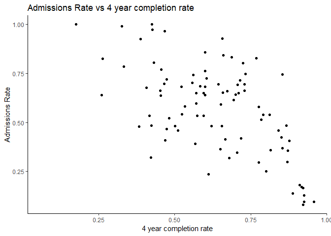
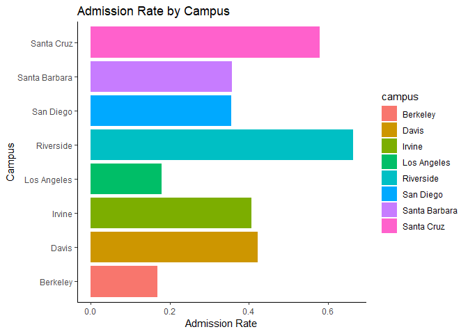

## Instructions
This exam is designed to show me what you have learned and where there are problems. You may use your notes and anything from the `class_files` folder, but please no internet searches. You have 35 minutes to complete as many of these exercises as possible on your own, and 10 minutes to work with a partner.  

At the end of the exam, upload the complete .Rmd file to your GitHub repository.  

1. Load the tidyverse.

```r
library(tidyverse)
```

```
## -- Attaching packages ------------------------------------------------------------------------------ tidyverse 1.2.1 --
```

```
## v ggplot2 3.1.0     v purrr   0.3.0
## v tibble  2.0.1     v dplyr   0.7.8
## v tidyr   0.8.2     v stringr 1.3.1
## v readr   1.3.1     v forcats 0.3.0
```

```
## -- Conflicts --------------------------------------------------------------------------------- tidyverse_conflicts() --
## x dplyr::filter() masks stats::filter()
## x dplyr::lag()    masks stats::lag()
```

```r
library(skimr)
```


2. For these questions, we will use data about California colleges. Load the `ca_college_data.csv` as a new object called `colleges`.

```r
CA_colleges <- read_csv("C:/Users/Stephanie T/Desktop/FRS_417/class_files-master/data/ca_college_data.csv")
```

```
## Parsed with column specification:
## cols(
##   INSTNM = col_character(),
##   CITY = col_character(),
##   STABBR = col_character(),
##   ZIP = col_character(),
##   ADM_RATE = col_double(),
##   SAT_AVG = col_double(),
##   PCIP26 = col_double(),
##   COSTT4_A = col_double(),
##   C150_4_POOLED = col_double(),
##   PFTFTUG1_EF = col_double()
## )
```


3. Use your preferred function to have a look at the data and get an idea of its structure.

```r
glimpse(CA_colleges)
```

```
## Observations: 341
## Variables: 10
## $ INSTNM        <chr> "Grossmont College", "College of the Sequoias", ...
## $ CITY          <chr> "El Cajon", "Visalia", "San Mateo", "Ventura", "...
## $ STABBR        <chr> "CA", "CA", "CA", "CA", "CA", "CA", "CA", "CA", ...
## $ ZIP           <chr> "92020-1799", "93277-2214", "94402-3784", "93003...
## $ ADM_RATE      <dbl> NA, NA, NA, NA, NA, NA, NA, NA, NA, NA, NA, NA, ...
## $ SAT_AVG       <dbl> NA, NA, NA, NA, NA, NA, NA, NA, NA, NA, NA, NA, ...
## $ PCIP26        <dbl> 0.0016, 0.0066, 0.0038, 0.0035, 0.0085, 0.0151, ...
## $ COSTT4_A      <dbl> 7956, 8109, 8278, 8407, 8516, 8577, 8580, 9181, ...
## $ C150_4_POOLED <dbl> NA, NA, NA, NA, NA, NA, 0.2334, NA, NA, NA, NA, ...
## $ PFTFTUG1_EF   <dbl> 0.3546, 0.5413, 0.3567, 0.3824, 0.2753, 0.4286, ...
```

```r
skim(CA_colleges)
```

```
## Skim summary statistics
##  n obs: 341 
##  n variables: 10 
## 
## -- Variable type:character --------------------------------------------------------------------------------------------
##  variable missing complete   n min max empty n_unique
##      CITY       0      341 341   4  19     0      161
##    INSTNM       0      341 341  10  63     0      341
##    STABBR       0      341 341   2   2     0        3
##       ZIP       0      341 341   5  10     0      324
## 
## -- Variable type:numeric ----------------------------------------------------------------------------------------------
##       variable missing complete   n     mean        sd        p0      p25
##       ADM_RATE     240      101 341     0.59     0.23     0.081      0.46
##  C150_4_POOLED     221      120 341     0.57     0.21     0.062      0.43
##       COSTT4_A     124      217 341 26685.17 18122.7   7956      12578   
##         PCIP26      35      306 341     0.02     0.038    0          0   
##    PFTFTUG1_EF      53      288 341     0.56     0.29     0.0064     0.32
##        SAT_AVG     276       65 341  1112.31   170.8    870        985   
##       p50       p75     p100     hist
##      0.64     0.75      1    <U+2583><U+2582><U+2585><U+2587><U+2586><U+2587><U+2585><U+2583>
##      0.58     0.72      0.96 <U+2581><U+2583><U+2583><U+2586><U+2587><U+2587><U+2583><U+2585>
##  16591    39289     69355    <U+2587><U+2583><U+2581><U+2582><U+2581><U+2581><U+2581><U+2581>
##      0        0.025     0.22 <U+2587><U+2581><U+2581><U+2581><U+2581><U+2581><U+2581><U+2581>
##      0.5      0.81      1    <U+2581><U+2585><U+2587><U+2586><U+2583><U+2585><U+2583><U+2587>
##   1078     1237      1555    <U+2586><U+2587><U+2585><U+2583><U+2583><U+2582><U+2582><U+2581>
```


4. What are the column names?
The column names are CITY, INSTNM, STABBR, ZIP, ADM_RATE, C150_4_POOLED, etc

```r
names(CA_colleges)
```

```
##  [1] "INSTNM"        "CITY"          "STABBR"        "ZIP"          
##  [5] "ADM_RATE"      "SAT_AVG"       "PCIP26"        "COSTT4_A"     
##  [9] "C150_4_POOLED" "PFTFTUG1_EF"
```

5. Are there any NA's in the data? If so, how many are present and in which variables?
Yes, they are in all the numeric data.


```r
CA_colleges %>% 
  purrr::map_df(~ sum(is.na(.)))
```

```
## # A tibble: 1 x 10
##   INSTNM  CITY STABBR   ZIP ADM_RATE SAT_AVG PCIP26 COSTT4_A C150_4_POOLED
##    <int> <int>  <int> <int>    <int>   <int>  <int>    <int>         <int>
## 1      0     0      0     0      240     276     35      124           221
## # ... with 1 more variable: PFTFTUG1_EF <int>
```


6. Which cities in California have the highest number of colleges?

## Los Angeles


```r
CA_colleges %>% 
  select(CITY, INSTNM) %>% 
  count(CITY) %>% 
  arrange(desc(n))
```

```
## # A tibble: 161 x 2
##    CITY              n
##    <chr>         <int>
##  1 Los Angeles      24
##  2 San Diego        18
##  3 San Francisco    15
##  4 Sacramento       10
##  5 Berkeley          9
##  6 Oakland           9
##  7 Claremont         7
##  8 Pasadena          6
##  9 Fresno            5
## 10 Irvine            5
## # ... with 151 more rows
```


7. The column `COSTT4_A` is the annual cost of each institution. Which city has the highest cost?

##Claremont

```r
CA_colleges %>% 
  group_by(CITY, INSTNM) %>% 
  summarise(max_cost = max(COSTT4_A)) %>% 
  arrange(desc(max_cost))
```

```
## # A tibble: 341 x 3
## # Groups:   CITY [161]
##    CITY          INSTNM                                        max_cost
##    <chr>         <chr>                                            <dbl>
##  1 Claremont     Harvey Mudd College                              69355
##  2 Los Angeles   Southern California Institute of Architecture    67225
##  3 Los Angeles   University of Southern California                67064
##  4 Los Angeles   Occidental College                               67046
##  5 Claremont     Claremont McKenna College                        66325
##  6 Malibu        Pepperdine University                            66152
##  7 Claremont     Scripps College                                  66060
##  8 Claremont     Pitzer College                                   65880
##  9 San Francisco San Francisco Art Institute                      65453
## 10 Claremont     Pomona College                                   64870
## # ... with 331 more rows
```


8. The column `ADM_RATE` is the admissions rate by college and `C150_4_POOLED` is the four-year completion rate. Use a scatterplot to show the relationship between these two variables. What does this mean?

```r
CA_colleges %>% 
  ggplot(aes(x = C150_4_POOLED, y = ADM_RATE)) +
  geom_point() +
  labs(title = "Admissions Rate vs 4 year completion rate",
       x = "4 year completion rate",
       y = "Admissions Rate") +
  theme_classic()
```

```
## Warning: Removed 251 rows containing missing values (geom_point).
```

<!-- -->

## The graph shows that as the admissions rate decreases then the four-year completion rate is higher.

9. The column titled `INSTNM` is the institution name. We are only interested in the University of California colleges. Run the code below and look at the output. Are all of the columns tidy? Why or why not?

```r
univ_calif <- CA_colleges %>% 
  filter_all(any_vars(str_detect(., pattern = "University of California")))
  
univ_calif
```

```
## # A tibble: 10 x 10
##    INSTNM CITY  STABBR ZIP   ADM_RATE SAT_AVG PCIP26 COSTT4_A C150_4_POOLED
##    <chr>  <chr> <chr>  <chr>    <dbl>   <dbl>  <dbl>    <dbl>         <dbl>
##  1 Unive~ La J~ CA     92093    0.357    1324  0.216    31043         0.872
##  2 Unive~ Irvi~ CA     92697    0.406    1206  0.107    31198         0.876
##  3 Unive~ Rive~ CA     92521    0.663    1078  0.149    31494         0.73 
##  4 Unive~ Los ~ CA     9009~    0.180    1334  0.155    33078         0.911
##  5 Unive~ Davis CA     9561~    0.423    1218  0.198    33904         0.850
##  6 Unive~ Sant~ CA     9506~    0.578    1201  0.193    34608         0.776
##  7 Unive~ Berk~ CA     94720    0.169    1422  0.105    34924         0.916
##  8 Unive~ Sant~ CA     93106    0.358    1281  0.108    34998         0.816
##  9 Unive~ San ~ CA     9410~   NA          NA NA           NA        NA    
## 10 Unive~ San ~ CA     9414~   NA          NA NA           NA        NA    
## # ... with 1 more variable: PFTFTUG1_EF <dbl>
```
## The columns are not very tidy because each row does not only have one observation paired with it. The institution names and zip code are also merged with a hyphen.

10. Use `separate()` to separate institution name into two new columns "UNIV" and "CAMPUS".

```r
separated <- univ_calif %>% 
  separate(INSTNM, into = c("univ", "campus"), sep = "-")
separated
```

```
## # A tibble: 10 x 11
##    univ  campus CITY  STABBR ZIP   ADM_RATE SAT_AVG PCIP26 COSTT4_A
##    <chr> <chr>  <chr> <chr>  <chr>    <dbl>   <dbl>  <dbl>    <dbl>
##  1 Univ~ San D~ La J~ CA     92093    0.357    1324  0.216    31043
##  2 Univ~ Irvine Irvi~ CA     92697    0.406    1206  0.107    31198
##  3 Univ~ River~ Rive~ CA     92521    0.663    1078  0.149    31494
##  4 Univ~ Los A~ Los ~ CA     9009~    0.180    1334  0.155    33078
##  5 Univ~ Davis  Davis CA     9561~    0.423    1218  0.198    33904
##  6 Univ~ Santa~ Sant~ CA     9506~    0.578    1201  0.193    34608
##  7 Univ~ Berke~ Berk~ CA     94720    0.169    1422  0.105    34924
##  8 Univ~ Santa~ Sant~ CA     93106    0.358    1281  0.108    34998
##  9 Univ~ Hasti~ San ~ CA     9410~   NA          NA NA           NA
## 10 Univ~ San F~ San ~ CA     9414~   NA          NA NA           NA
## # ... with 2 more variables: C150_4_POOLED <dbl>, PFTFTUG1_EF <dbl>
```


11. As a final step, remove `Hastings College of Law` and `UC San Francisco` and store the final data frame as a new object `univ_calif_final`.

```r
univ_calif_final <- separated %>% 
  filter(campus != "San Francisco", campus != "Hastings College of Law")

univ_calif_final
```

```
## # A tibble: 8 x 11
##   univ  campus CITY  STABBR ZIP   ADM_RATE SAT_AVG PCIP26 COSTT4_A
##   <chr> <chr>  <chr> <chr>  <chr>    <dbl>   <dbl>  <dbl>    <dbl>
## 1 Univ~ San D~ La J~ CA     92093    0.357    1324  0.216    31043
## 2 Univ~ Irvine Irvi~ CA     92697    0.406    1206  0.107    31198
## 3 Univ~ River~ Rive~ CA     92521    0.663    1078  0.149    31494
## 4 Univ~ Los A~ Los ~ CA     9009~    0.180    1334  0.155    33078
## 5 Univ~ Davis  Davis CA     9561~    0.423    1218  0.198    33904
## 6 Univ~ Santa~ Sant~ CA     9506~    0.578    1201  0.193    34608
## 7 Univ~ Berke~ Berk~ CA     94720    0.169    1422  0.105    34924
## 8 Univ~ Santa~ Sant~ CA     93106    0.358    1281  0.108    34998
## # ... with 2 more variables: C150_4_POOLED <dbl>, PFTFTUG1_EF <dbl>
```


12. The column `ADM_RATE` is the admissions rate by campus. Which UC has the lowest and highest admissions rates? Please use a barplot.

## Highest admissions is Riverside. Lowest admissions is Berkeley.

```r
univ_calif_final %>% 
  ggplot(aes(x = campus, y = ADM_RATE, fill = campus)) +
  geom_bar(stat =  "identity") +
  labs(title = "Admission Rate by Campus",
       x = "Campus",
       y = "Admission Rate") +
  theme_classic()+
  coord_flip()
```

<!-- -->


## Knit Your Output and Post to [GitHub](https://github.com/FRS417-DataScienceBiologists)
